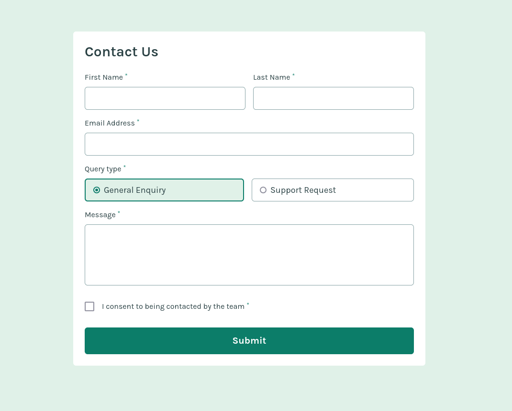

# Frontend Mentor - Contact form solution

This is a solution to the [Contact form challenge on Frontend Mentor](https://www.frontendmentor.io/challenges/contact-form--G-hYlqKJj). Frontend Mentor challenges help you improve your coding skills by building realistic projects. 

## Table of contents

- [Overview](#overview)
  - [The challenge](#the-challenge)
  - [Screenshot](#screenshot)
  - [Links](#links)
- [My process](#my-process)
  - [Built with](#built-with)
  - [What I learned](#what-i-learned)
  - [Continued development](#continued-development)
- [Author](#author)

## Overview

### The challenge

Users should be able to:

- Complete the form and see a success toast message upon successful submission
- Receive form validation messages if:
  - A required field has been missed
  - The email address is not formatted correctly
- Complete the form only using their keyboard
- Have inputs, error messages, and the success message announced on their screen reader
- View the optimal layout for the interface depending on their device's screen size
- See hover and focus states for all interactive elements on the page

### Screenshot

### Links

- Solution URL: [Add solution URL here](https://github.com/jambanix/frontendmentor_contact-form)
- Live Site URL: [Add live site URL here](https://jambanix.github.io/frontendmentor_contact-form/)

## My process

### Built with

- [React](https://reactjs.org/) - JS library
- [TailwindCSS](https://tailwindcss.com/) - TailwindCSS
- [react-hook-form](https://react-hook-form.com/) - React Hook Form

### What I learned

This challenge further reinforced my understanding of react-hook-form, and was my 2nd time using it. I focussed on creating a clean solution with reusable components

### Continued development

Continue to do more challenges alongside the Udemy courses

## Author

- Frontend Mentor - [@yourusername](https://www.frontendmentor.io/profile/jambanix)
- Github- [@jambanix](https://www.github.com/jambanix)
